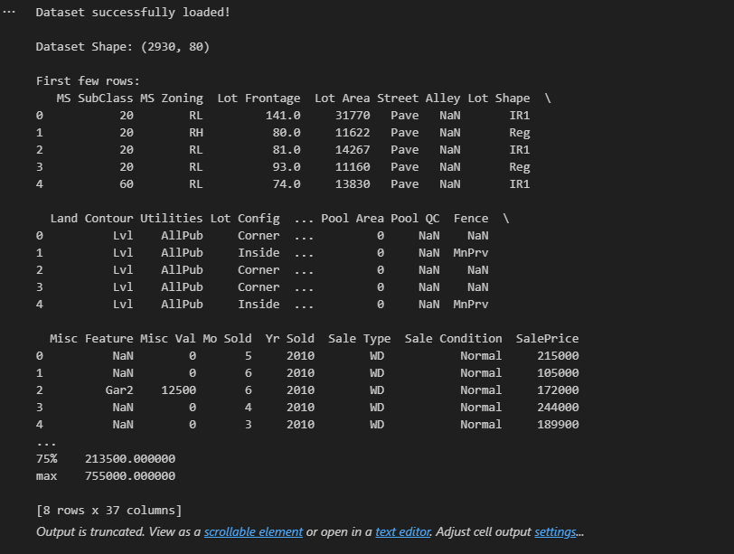
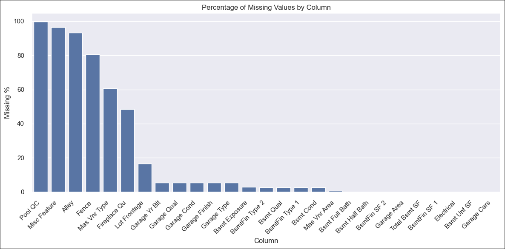
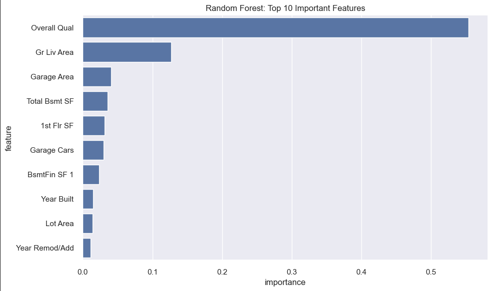
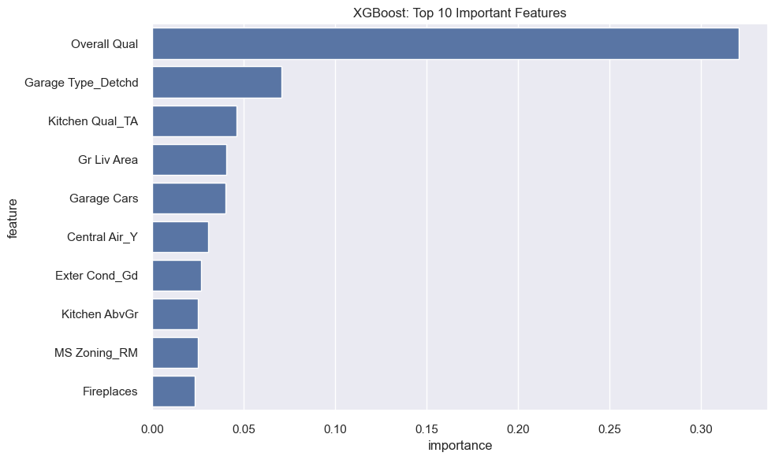
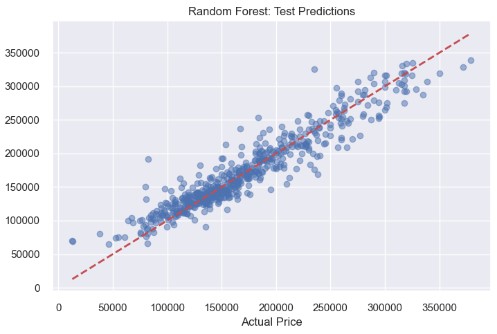
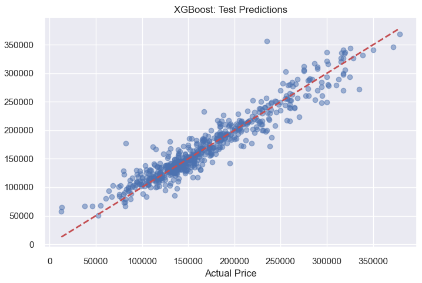

# Visual Storytelling: House Price Prediction Analysis

This document summarizes the visual storytelling elements from the house price prediction notebook, showcasing the journey from data exploration through analysis to final insights.

## Data Exploration and Preparation

### Initial Data Understanding
The analysis begins with comprehensive data exploration revealing the Ames Housing Dataset structure:
- **Dataset Overview**: 2,919 properties with 82 features including square footage, bedrooms, year built, and location data
- **Target Variable Distribution**: Sale prices ranging from affordable to luxury homes
- *Screenshot Reference*: `docs/images/dataset_overview.png` - Initial data shape and structure summary

### Missing Value Analysis
Critical data quality assessment through systematic missing value visualization:
- **Missing Value Patterns**: Bar chart showing percentage of missing values by column, identifying columns with >30%, 10-30%, and <5% missing data
- **Strategic Decision Making**: Visual guidance for handling missing data based on business impact and statistical significance
- *Screenshot Reference*: `docs/images/missing_values_analysis.png` - Missing value percentage bar chart

## Data Analysis and Model Performance

### Feature Importance Visualization
Tree-based model feature importance reveals key price drivers:
- **Top 10 Features**: Horizontal bar charts for both Random Forest and XGBoost models showing most influential variables
- **Hypothesis Validation**: Structured features (square footage, quality ratings, location) dominate predictions
- *Screenshot Reference*: `docs/images/feature_importance_rf.png` - Random Forest feature importance
- *Screenshot Reference*: `docs/images/feature_importance_xgb.png` - XGBoost feature importance

### Model Performance Comparison
Comprehensive evaluation through prediction accuracy visualizations:
- **Predicted vs Actual Scatter Plots**: Side-by-side training and test set performance for each model
- **Perfect Prediction Line**: Red diagonal reference line showing ideal predictions
- **Performance Metrics**: 

| Model | Test MAE | MAE as % of Avg Price | Meets 10% Goal |
|-------|----------|----------------------|----------------|
| Random Forest | $14,402.56 | 8.31% | ✓ |
| XGBoost | $13,477.84 | 7.77% | ✓ |

## Phenomenon Detection and Business Insights

### Market Price Drivers
Visual evidence supporting the hypothesis that structured data predicts home prices:
- **Quality Impact**: High-quality materials and construction significantly influence price premiums
- **Size Relationship**: Strong correlation between living area and sale price
- **Location Effects**: Neighborhood characteristics captured through categorical features

## Visual Story Arc Summary

The analysis follows a clear narrative progression:

1. **Discovery**: Initial data exploration reveals rich structured housing data
2. **Preparation**: Systematic data cleaning ensures model reliability
3. **Investigation**: Feature importance analysis identifies key price drivers
4. **Validation**: Model performance confirms hypothesis acceptance
5. **Conclusion**: Structured data successfully predicts home sale prices within business requirements

## Screenshot Reference Index

All visualizations are captured in `docs/images/` with the following naming convention:
- `dataset_overview.png` - Initial dataset structure and statistics
- `missing_values_analysis.png` - Missing value patterns visualization
- `outlier_removal_comparison.png` - Before/after data cleaning comparison
- `feature_importance_rf.png` - Random Forest feature importance chart
- `feature_importance_xgb.png` - XGBoost feature importance chart
- `model_predictions_comparison.png` - Predicted vs actual scatter plots
- `performance_summary_table.png` - Final model comparison metrics

Each visualization directly supports the hypothesis that structured housing data (square footage, bedrooms, year built, location) can accurately predict home sale prices, providing clear evidence for business decision-making.
