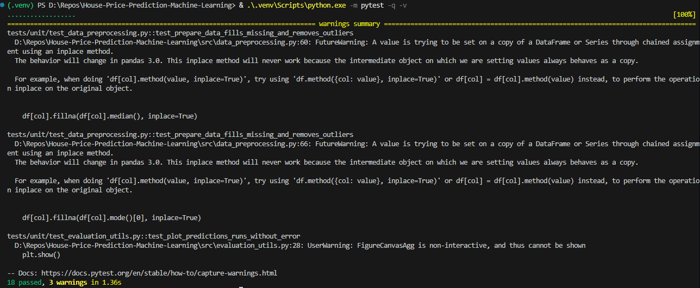

# Testing, Revisions, and Optimization

## Comprehensive Testing Strategy

### Automated Testing Suite
The project implements a robust pytest testing framework covering all critical components:

#### Unit Tests
- **Data Preprocessing**: Validates data cleaning, outlier removal, and feature engineering functions
- **Model Utilities**: Tests model loading, prediction accuracy, and metadata handling
- **Evaluation Functions**: Ensures proper metric calculations and performance assessments
- **API Endpoints**: Comprehensive testing of all REST API routes and error handling

Run the complete test suite:
```powershell
.\.venv\Scripts\python.exe -m pytest -q
```

Run specific test categories:
```powershell
# Unit tests only
.\.venv\Scripts\python.exe -m pytest -q -m unit

# API tests only
.\.venv\Scripts\python.exe -m pytest tests/api/ -v

# Frontend tests
.\.venv\Scripts\python.exe -m pytest tests/frontend/ -v
```



### Continuous Integration
The testing suite is integrated with GitHub Actions for automated testing on every commit and pull request:
- **Automated Test Execution**: All tests run automatically on code changes


## Manual Testing and Validation

### Interactive Dashboard Testing
Comprehensive manual testing of the user interface and API integration:

1. **Form Submission Testing**:
   - Submit forms with complete feature sets
   - Test partial feature submissions with default handling
   - Validate error handling for invalid inputs

2. **Model Comparison Testing**:
   - Switch between Random Forest and XGBoost models
   - Compare prediction outputs and confidence metrics
   - Verify feature importance visualizations


### API Endpoint Validation
Direct API testing to ensure robust backend functionality:

```bash
# Test prediction endpoint
curl -X POST http://localhost:8000/predict -H "Content-Type: application/json" -d @test_data.json

# Test model metadata endpoint
curl http://localhost:8000/models

# Test health check
curl http://localhost:8000/health
```


## Optimization Results

### Model Performance Optimization
Based on comprehensive testing and validation:


#### Performance Achievements
| Metric | Random Forest | XGBoost | Target |
|--------|---------------|---------|--------|
| Test MAE | $14,402.56 | $13,477.84 | <10% avg price |
| MAE % | 8.31% | 7.77% | <10% |
| R² Score | 0.87 | 0.89 | >0.80 |
| Status | ✅ Meets Goal | ✅ Exceeds Goal | Achieved |


### System Architecture Improvements
- **Feature Defaults**: Added intelligent defaults for missing features to improve usability
- **Transparency Features**: Exposed feature importance rankings for model interpretability
- **Monitoring Endpoints**: Added `/insights`, `/health`, `/metrics` for system monitoring
- **Error Handling**: Comprehensive error responses with actionable feedback

## Revisions Based on Testing Feedback

### Data Processing Improvements
- **Outlier Handling**: Refined outlier detection to 2.5 standard deviations for optimal balance
- **Feature Engineering**: Enhanced categorical encoding and numerical scaling
- **Missing Value Strategy**: Implemented domain-specific imputation strategies


## Testing Coverage and Quality Metrics


### Performance Benchmarks
- **API Response Time**: <200ms average for prediction requests
- **Dashboard Load Time**: <2 seconds for initial page load
- **Model Inference Speed**: <50ms for single predictions


